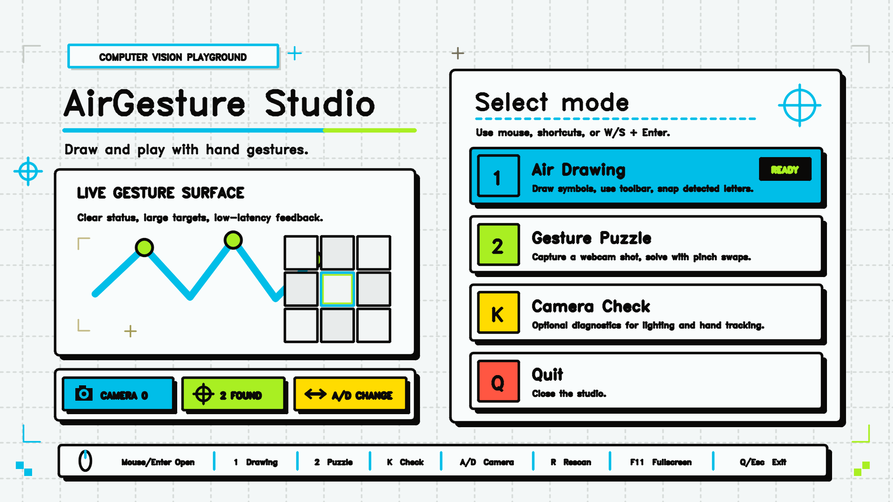
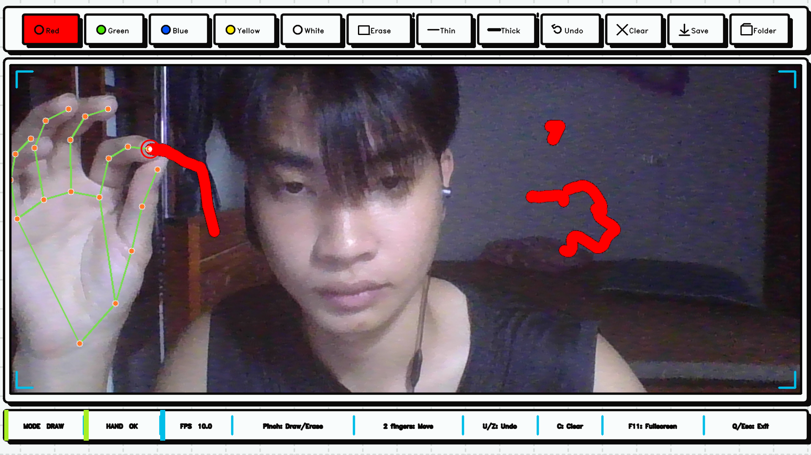
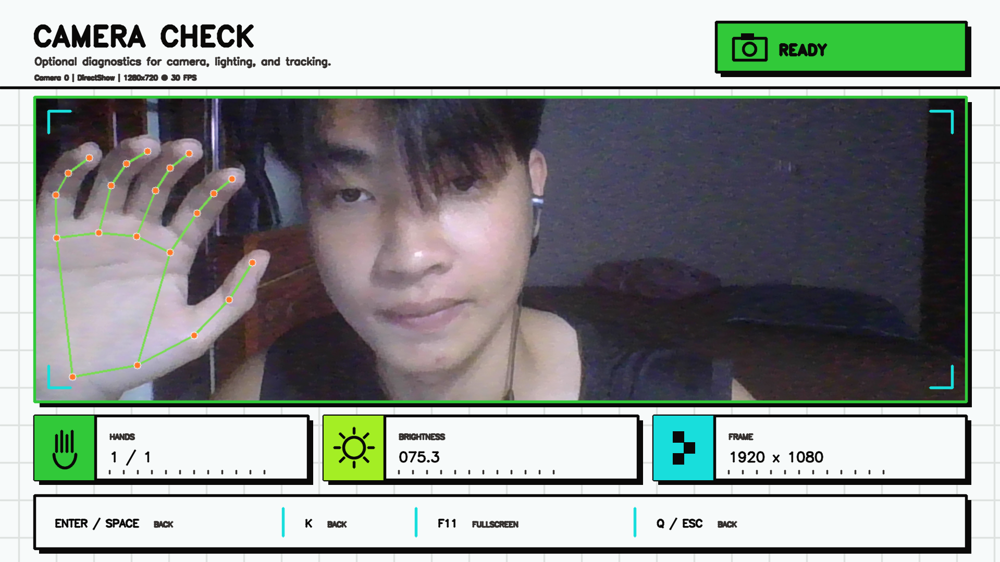
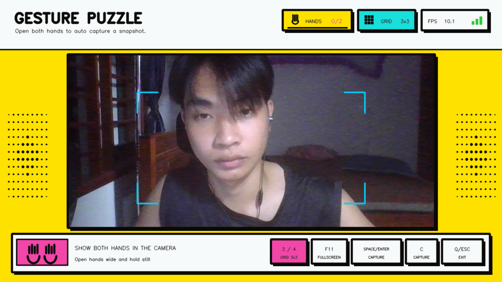
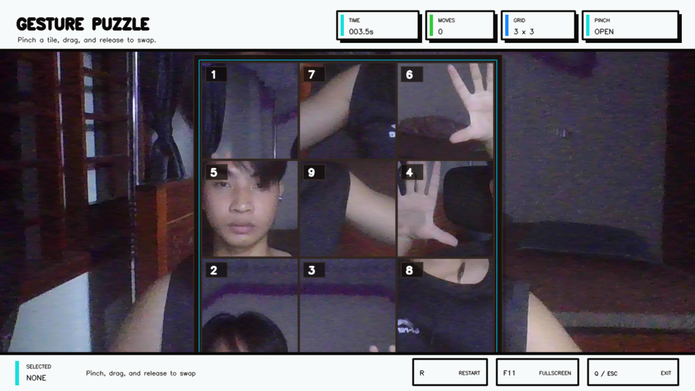

# Hand Gesture Air Drawing System

This project has two gesture-controlled experiences:

- Air drawing: draw with your hand, use a gesture toolbar, clean strokes, and snap simple strokes into clean letters or digits.
- Gesture puzzle: capture a webcam image and solve a 3x3 tile puzzle with pinch gestures.

## Demo

### AirGesture Studio



| Air Drawing | Camera Check |
| --- | --- |
|  |  |

| Gesture Puzzle Capture | Gesture Puzzle Play |
| --- | --- |
|  |  |

## Requirements

- Python 3.14 (64-bit)
- Windows 10 or Windows 11
- A working webcam

Create an isolated environment and install the pinned runtime dependencies:

```powershell
python --version
python -m venv .venv
.venv\Scripts\python.exe -m pip install --upgrade pip
.venv\Scripts\python.exe -m pip install -r requirements.txt
```

For development, use the editable installation file instead:

```powershell
.venv\Scripts\python.exe -m pip install -r requirements-dev.txt
.venv\Scripts\python.exe -m unittest discover -s tests -v
```

Runtime dependency versions have a single source of truth in `pyproject.toml`.
The project uses `opencv-contrib-python`; do not install `opencv-python` into the
same environment because both distributions provide the `cv2` package.

## Adjust Tracking Settings

On first run, the bundled defaults are copied to
`%LOCALAPPDATA%\AirGesture\config\settings.json`. Edit that writable user copy
and restart the application after changing it. Set `AIRGESTURE_SETTINGS_PATH`
to use a different settings file.

- `camera`: camera index, resolution, FPS, mirroring, discovery limit, read-failure tolerance, and reconnect policy
- `air_drawing.adaptive_smoothing`: slow/fast smoothing alpha, speed range, and missing-frame tolerance
- `air_drawing.pinch`: pinch/release distances and missing-frame tolerance
- `air_drawing.recognition`: snap confidence, runner-up margin, top suggestions, raster image, and optional ONNX model
- `air_drawing.drawing`: stroke debounce, bridging, undo depth, recognition display time, brush, and eraser sizes
- `puzzle.capture`: spread ratio, stable-frame count, centering, and motion thresholds
- `puzzle.game`: countdown, default difficulty, and board size
- `tracker.landmark_filter`: adaptive landmark smoothing values for each mode

Useful tuning directions:

- For the puzzle cursor, increase smoothing `alpha` for faster response; decrease it for steadier movement.
- Increase `slow_alpha` if slow drawing feels heavy; increase `fast_alpha` if fast strokes lag behind.
- Increase `pinch_threshold` if pinching is hard to trigger. Keep `release_threshold` higher.
- Decrease `spread_ratio_required` if puzzle auto-capture is difficult to activate.
- Decrease `stable_frames_required` or increase motion thresholds if holding still is difficult.
- Increase `thin_brush_size`, `thick_brush_size`, or `eraser_size` to change tool sizes.

Invalid JSON, unknown fields, and unsafe values are rejected with a clear startup error.

## Run Main Menu

```powershell
.venv\Scripts\python.exe -m airgesture
```

When the terminal is already inside the `airgesture` folder, the direct launcher is also supported:

```powershell
.venv\Scripts\python.exe app.py
```

Menu controls:

- Mouse: hover and click a mode
- `1`: Air Drawing
- `2`: Gesture Puzzle
- `K`: optional Camera Check
- `W` / `S`: select menu item
- `A` / `D`: select the previous or next discovered camera
- `R`: rescan connected cameras
- `Enter`: open selected item
- `Q` or `Esc`: quit
- `F11`: toggle fullscreen; `Esc` leaves fullscreen before quitting

Camera Check:

- Air Drawing and Gesture Puzzle now open directly without a calibration step
- Press `K` from the menu to inspect camera framing, brightness, and hand tracking
- The window title reports the active camera index, backend, actual resolution, and driver-reported FPS
- `Enter`, `Space`, `K`, `Q`, or `Esc`: return to the menu
- `F11`: toggle fullscreen; `Esc` leaves fullscreen before returning

Camera selection applies to Drawing, Puzzle, and Camera Check for the current
application session. On Windows, camera startup falls back through DirectShow,
Media Foundation, and the default OpenCV backend. Brief frame failures are
retried, followed by bounded automatic reconnection attempts when necessary.

## Run Air Drawing

```powershell
.venv\Scripts\python.exe -m airgesture.drawing.main
```

Air drawing controls:

- Pinch thumb + index finger: draw or erase
- Index + middle fingers: move cursor without drawing and select toolbar items
- Draw a one-stroke letter or digit (`A-Z`, `0-9`), then release pinch: snap it into a clean symbol when recognized
- A symbol is snapped only when confidence and the lead over the runner-up are high enough
- The top overlay shows `PHAT HIEN` for an accepted symbol or `GOI Y` with up to three uncertain candidates
- `c`: clear drawing canvas
- `u` or `z`: undo the last committed drawing or eraser stroke
- `o`: open the saved drawings folder
- `q`: quit
- `Esc`: quit
- `F11`: toggle fullscreen; `Esc` leaves fullscreen before quitting

Toolbar:

- `Red`, `Green`, `Blue`, `Yellow`, `White`: change brush color
- `Erase`: erase parts of the canvas
- `Thin`, `Thick`: change brush size
- `Clear`: clear the canvas
- `Save`: atomically save the drawing to the user Drawings folder
- `Folder`: open the saved drawings folder in Windows Explorer
- `Undo`: restore the canvas before the last drawing or eraser stroke

Save success or failure is shown directly over the drawing view. Saved files
use microsecond timestamps, and an additional unique suffix is added rather
than overwriting an existing file.

## Run Gesture Puzzle

```powershell
.venv\Scripts\python.exe -m airgesture.puzzle.main
```

Puzzle controls:

- Two-hand capture gesture: show both hands, open them wide enough to frame the shot, then hold still briefly for auto capture
- `3` / `4`: choose 3x3 or 4x4 difficulty before capture
- `Space`, `Enter`, or `C`: fallback capture
- The HUD shows `Hands: 0/2`, `1/2`, or `2/2`; auto capture starts when both hands are visible and stable
- A short countdown runs after capture before the puzzle starts
- Move hand: control cursor
- Pinch on a tile: grab/select tile
- Release over another tile: swap tiles
- `r`: restart during play or after victory
- `q` or `Esc`: quit
- `F11`: toggle fullscreen; `Esc` leaves fullscreen before quitting

## Features

- Responsive main menu with camera selection, fullscreen support, and optional diagnostics
- Reliable Windows webcam capture with backend fallback and automatic reconnection
- Local MediaPipe hand tracking with adaptive smoothing and dropout tolerance
- Gesture-controlled Air Drawing with colors, brush sizes, eraser, undo, save, and clear
- One-stroke recognition for `A-Z` letters and `0-9` digits
- Gesture Puzzle with automatic capture, 3x3/4x4 difficulty, pinch swapping, timer, and move counter
- Configurable tracking profiles with safe camera and window cleanup

## Roadmap

- Full-word handwriting recognition
- Bundled trained ONNX handwriting model
Not implemented yet:

- Recognition for full handwriting words
- A bundled, trained handwriting ONNX model; the runtime integration is ready for an external model

## Optional ONNX Recognition

Set `air_drawing.recognition.onnx_model_path` in the user settings file to a
model filename stored under `%LOCALAPPDATA%\AirGesture\models`. Leave it as
`null` to use template recognition only. An absolute model path is also
supported.

The configured model must accept a normalized grayscale stroke tensor shaped `1 x 1 x 64 x 64` and return one score for each character in `onnx_labels`. By default the expected output order is `A-Z`, followed by `0-9`. Template and ONNX scores are combined using `onnx_weight` before confidence and ambiguity checks are applied.

## Project Structure

```text
airgesture/
|-- __main__.py
|-- app.py
|-- calibration.py
|-- paths.py
|-- config/
|   |-- settings.py
|   `-- settings.json
|-- resources/
|   `-- models/
|       `-- hand_landmarker.task
|-- core/
|   |-- camera.py
|   |-- hand_tracker.py
|   `-- smoothing.py
|-- drawing/
|   |-- main.py
|   |-- canvas.py
|   |-- display.py
|   |-- gesture_controller.py
|   |-- letter_recognizer.py
|   `-- toolbar.py
|-- puzzle/
|   |-- main.py
|   |-- board.py
|   |-- capture_gesture.py
|   |-- gesture.py
|   `-- hud.py
`-- ui/
    `-- theme.py

tests/
```

## Runtime Data Locations

- Settings: `%LOCALAPPDATA%\AirGesture\config\settings.json`
- MediaPipe metrics consent: `%LOCALAPPDATA%\AirGesture\privacy.json`
- Cache: `%LOCALAPPDATA%\AirGesture\cache`
- Rotating runtime log: `%LOCALAPPDATA%\AirGesture\logs\airgesture.log`
- Optional ONNX models: `%LOCALAPPDATA%\AirGesture\models`
- Saved drawings: `%USERPROFILE%\Documents\AirGesture\Drawings`

For portable or automated environments, the roots can be overridden with
`AIRGESTURE_DATA_DIR`, `AIRGESTURE_DOCUMENTS_DIR`, and
`AIRGESTURE_DRAWINGS_DIR`.

Camera, tracking, configuration, and unexpected OpenCV failures are shown in a
native error dialog. Expected failures are also written to the runtime log so
packaged builds do not depend on a visible terminal.

## Privacy and Licensing

Before the first hand-tracking session, AirGesture displays a privacy notice
and requires explicit consent for MediaPipe's operational metrics processing.
The default choice is No, and declining prevents the MediaPipe Task from being
initialized. Camera frames and hand landmarks are processed locally.

See [PRIVACY.md](PRIVACY.md) for data locations, retention, consent revocation,
and strict offline deployment guidance. See
[THIRD_PARTY_NOTICES.md](THIRD_PARTY_NOTICES.md) for exact dependency versions,
model provenance, required license files, and the remaining model redistribution
approval item. AirGesture source code is currently marked all-rights-reserved in
[LICENSE](LICENSE); the copyright holder should replace that choice before a
public open-source release if a permissive or copyleft license is intended.
